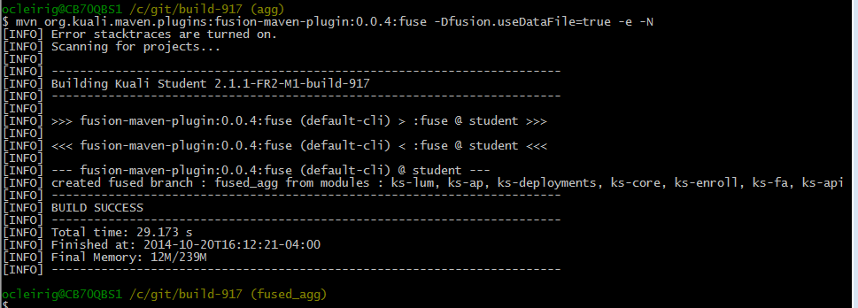

# How to extract a build tag and fuse it

## Prepare a new git repository with a working copy

``` $ git init build-917 ```

## Add this content to fetch the module and aggregate branches for build 917

You can find out the different modules by looking at the svn.externals file in the aggregate or the fusion-maven-plugin.dat file.

If you try and fuse something and are missing some modules the process will fail.


[remote "origin"]
	url = https://github.com/kuali-student/archived-from-svn.git

	fetch = refs/heads/enrollment_aggregate_tags_builds_student-2.1_2.1.1-FR2-M1_build-917:
		refs/remotes/origin/enrollment_aggregate_tags_builds_student-2.1_2.1.1-FR2-M1_build-917

	fetch = refs/heads/enrollment_ks-api_tags_builds_ks-api-2.1_2.1.1-FR2-M1_build-917:
		refs/remotes/origin/enrollment_ks-api_tags_builds_ks-api-2.1_2.1.1-FR2-M1_build-917

	fetch = refs/heads/enrollment_ks-lum_tags_builds_ks-lum-2.1_2.1.1-FR2-M1_build-917:
		refs/remotes/origin/enrollment_ks-lum_tags_builds_ks-lum-2.1_2.1.1-FR2-M1_build-917

	fetch = refs/heads/enrollment_ks-core_tags_builds_ks-core-2.1_2.1.1-FR2-M1_build-917:
		refs/remotes/origin/enrollment_ks-core_tags_builds_ks-core-2.1_2.1.1-FR2-M1_build-917

	fetch = refs/heads/enrollment_ks-enroll_tags_builds_ks-enroll-0.2_0.2.0-FR2-M1_build-917:
		refs/remotes/origin/enrollment_ks-enroll_tags_builds_ks-enroll-0.2_0.2.0-FR2-M1_build-917

	fetch = refs/heads/enrollment_ks-ap_tags_builds_ks-ap-0.8_0.8.0-FR2-M1_build-917:
		refs/remotes/origin/enrollment_ks-ap_tags_builds_ks-ap-0.8_0.8.0-FR2-M1_build-917

	fetch = refs/heads/enrollment_ks-fa_tags_builds_ks-fa-0.1_0.1.0-FR2-M1_build-917:
		refs/remotes/origin/enrollment_ks-fa_tags_builds_ks-fa-0.1_0.1.0-FR2-M1_build-917

	fetch = refs/heads/enrollment_ks-deployments_tags_builds_ks-deployments-2.1_2.1.1-FR2-M1_build-917:
		refs/remotes/origin/enrollment_ks-deployments_tags_builds_ks-deployments-2.1_2.1.1-FR2-M1_build-917




## Fetch refs from origin

``` $ git fetch origin ```

``` $ git checkout -b aggregate origin/enrollment_aggregate_<tab> ```

Press the *TAB* key where indicated to have git autocomplete the branch name to avoid having to type it all in.

``` $ mvn org.kuali.maven.plugins:fusion-maven-plugin:0.0.4:fuze -Dfusion.useFusionDataFile=true -e -N ```



# Rewrite the Fused commit message and reset the author

The Fuse mojo was originally intended to be used within the Kuali CI so it by default uses the Jeff Caddel name like it used to work in Subversion CI dev ops.

If you want a different author, like yourself, to be used you can ammend the commit at this point to reset the author and change the commit message.

``` $ git commit --ammend --reset-author ```

