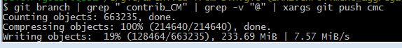

# How to extract a subgraph from the original converted repository

The full repository contains build tags along all of the different product streams and branches that were deleted, etc.

While useful in a historical context having so many branches slows git down and makes it complicated to review the project history.

In Git it is the graph that is important.

For the most part you can just take a few key branches and any history that they are connected to (essentially the root of the graph) instead of the build tags and other streams of work (the leaf's of the tree).

This page describes the mechanics of extracting a subset of the archived-from-svn repository.

# Example: Extract KS Trunk and CM 2.0 Branches from archived-from-svn

In order to support the continued development of kuali student the existing development branches for trunk and CM 2.0 were extracted.

We create an empty git repository and then fetch specificially named branches.  Typically the next step would be to apply the fusion-maven-plugin configuration to the aggregate branch and then perform the fusion operations.

Then once things were fused the fused branches could be uploaded into a new git repository.

## Initialize a local non-bare git repository

```
$ git init ks-dev
```

## Add a remote to the archived-from-svn repository

```
$ git remote add origin 
```

The reason we use the remote name of origin is that the __fusion-maven-plugin's__ fuse mojo looks for local branches and branches in the origin remote namespace.

In the future this remote name could be made configurable but for now just use 'origin' as the name of the remote.

## Edit the .git/config file to add in the specific branches we are interested in

Find the __remote__ section for _origin_:

### Default remote configuration to fetch all branches



[remote "origin"]
    url = https://github.com/kuali-student/archived-from-svn.git

    fetch = +refs/heads/*:refs/remotes/origin/*
    


This will look for all of the refs in the origin repository heads directory and then download those into the refs/remotes/origin directory in the local repository.

But it will do it for all of the branches which we don't want in this case.

### Specifically Select the branches to fetch



[remote "origin"]
	url = https://github.com/kuali-student/archived-from-svn.git

	fetch = refs/heads/enrollment_aggregate_trunk:refs/remotes/origin/enrollment_aggregate_trunk
   	fetch = refs/heads/enrollment_ks-enroll_trunk:refs/remotes/origin/enrollment_ks-enroll_trunk
	fetch = refs/heads/enrollment_ks-fa_trunk:refs/remotes/origin/enrollment_ks-fa_trunk
	fetch = refs/heads/enrollment_ks-ap_trunk:refs/remotes/origin/enrollment_ks-ap_trunk
	fetch = refs/heads/enrollment_ks-lum_trunk:refs/remotes/origin/enrollment_ks-lum_trunk
	fetch = refs/heads/enrollment_ks-core_trunk:refs/remotes/origin/enrollment_ks-core_trunk
	fetch = refs/heads/enrollment_ks-api_branches_2.0.0-Mx:refs/remotes/origin/enrollment_ks-api_branches_2.0.0-Mx
	fetch = refs/heads/enrollment_ks-deployments_trunk:refs/remotes/origin/enrollment_ks-deployments_trunk
	
	fetch = refs/heads/enrollment_aggregate_branches_CM-2.0:refs/remotes/origin/enrollment_aggregate_branches_CM-2.0
	fetch = refs/heads/enrollment_ks-lum_branches_CM-2.0:refs/remotes/origin/enrollment_ks-lum_branches_CM-2.0
	fetch = refs/heads/enrollment_ks-core_branches_CM-2.0:refs/remotes/origin/enrollment_ks-core_branches_CM-2.0
	fetch = refs/heads/enrollment_ks-api_branches_CM-2.0:refs/remotes/origin/enrollment_ks-api_branches_CM-2.0
	fetch = refs/heads/enrollment_ks-deployments_branches_CM-2.0:refs/remotes/origin/enrollment_ks-deployments_branches_CM-2.0


	fetch = refs/heads/enrollment_aggregate_branches_services:refs/remotes/origin/enrollment_aggregate_branches_services
	fetch = refs/heads/enrollment_ks-api_trunk:refs/remotes/origin/enrollment_ks-api_trunk




## Fetch the specificially named branches

```
$ git fetch origin
```

## Create local branches

At this point you can fuse and or select which branches you want.

And then push into the target repository.

```
$ git push target <specific local branch>
```

# Example: Extract CM Contribution Branches from archived-from-svn

The CM Contribution branches were a special aggregate created on top of one of the CM releases.

To support community contributions we should extract all of the CM contribution branches aswell as the CM 2.0.0 release branches.

Then we can convert some of the branches into tags (for things like the build tags and release tags).

## Checkout the full repository locally as a bare repository.


$ cd git
$ git clone --bare https://github.com/kuali-student/archived-from-svn.git


## Create the cm-contribution repository locally

```
$ git init --bare cm-contribution
```

## Register the remote in the archived-from-svn repository



$ cd archived-from-svn
$ git remote add cmc ../cm-contribution


## Now select the contrib_CM_* prefixed branches and send them to the myplan repo

In the archived-from-svn repository clone run:

```
$ git branch | grep " contrib_CM" | grep -v "@" | xargs git push cmc
```


The conversion process tracked when branches were deleted and suffixed the revision where the delete took place to the name of the branch.  The **grep -v "@"** part excludes any branches that represent deletes as they are not needed.

When the number of branches is large you might need to manually specify a lower max limit:
```
$ git branch | grep " contrib_CM" | grep -v "@" | xargs git -n 15 push cmc
```

Or resort to loading them one by one:

```
$ git branch | grep " contrib_CM" | grep -v "@" | while read B; do git push cmc $B; done
```

Because of the delay in doing it this way this should be a local or in memory operation and then pushed into github after all of the branches have been migrated.

#### Example of push output



## Create CM 2.x release tags and push to the cm-contribution repository

### Push the student-2.x release branches to the cm-contribution repository


$ cd archived-from-svn
$ git branch | grep " enrollment_aggregate_tags_student-2.0." | xargs git push cmc


### Create tags from the branch and delete the branches


$ cd cm-contribution
$ git branch | grep " enrollment_aggregate_tags_student-2.0." | less

$ git tag student-2.0.0-cm enrollment_aggregate_tags_student-2.0.0-cm
$ git tag student-2.0.1-cm enrollment_aggregate_tags_student-2.0.1-cm
$ git tag student-2.0.2-cm enrollment_aggregate_tags_student-2.0.2-cm
$ git tag student-2.0.3-cm enrollment_aggregate_tags_student-2.0.3-cm

$ git branch | grep " enrollment_aggregate_tags_student-2.0." | xargs git branch -D



## Convert build tag branches to git tags

Inside the git-repository-tools/git-importer artifact there is a program called ConvertBuildTagBranchesToGit and it will parse the long structure and create a tag without the leading enrollment_aggregate_tags_builds part.


