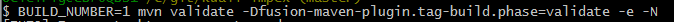

# Impex Process

## CM 2.x Impex Process

In the CM 2.x branches the old impex process was used and in that process the xml files ended in .xml and these were not purged from the repository

## Fused Impex Process

First make sure that you are using a [fused branch](extract-and-fuse-a-build-tag.html). Then follow these steps from the [Student Developer Guide](https://wiki.kuali.org/display/STUDENTDOC/3.2.2+Manual+Process):


1. checked the fused branch 
2. mvn clean install -Pimpex-only,sql-only
3. cd ks-deployments/ks-dbs/ks-impex
4. mvn initialize -Psource-db,local -N
5. mvn generate-resources -Pdump,local -N
6. mvn process-resources -Pimpexscm -N
7. cd ../../..
8. mvn clean install -Pimpex-only,sql-only
9. git add ks-deployments/ks-db/ks-impex/*/src/main/resources
10. git commit -m "Commiting impex changes"

**Step 4** creates the bootstrapping database from the -sql artifacts.

**Step 5** dumps out the .mpx files for each table in the db created in step 4.

**Step 6** moves the .mpx files back into the source code of the ks-impex-app-db and ks-impex-rice-db artifacts.

**Step 8** rebuilds the impex artifacts so that loading the data using the updated files becomes possible.

In subversion step 6 had an option to automatically commit the changed .mpx files.  

That is now accomplished in steps 9 and 10.

## Split Impex Process
In the CM 2.x release the wiki steps for the legacy impex process can be followed.

In the master branch of the ks-development and ks-development-impex repositories the following process should be used.

1. tag ks-development build X
2. build -sql jars from ks-development
3. tag ks-development-impex build X
4. run the manual impex process which generates .mpx files
5. git add the .mpx files and commit them into the repository 
5.1 create a build tag on the files
6. load the impex data from the ks-development:ks-deployments/ks-dbs/ks-impex artifact (it will resolve using maven the artifacts created in step 5). 

Ideally the results of the manual impex process would be published into the kuali nexus repository however it can also work if the .mpx files are added into the Git repository and pushed into github.

The github 100 MB file max size will still apply so remember to keep an eye on the total amount of data that is added.  Github's limit is based on the size of the file when materialized in the file system not its actual delta compressed size which is typically much smaller.
## Example: Tag ks-development build 1

In the ks-development root directory, tag build 1:

``` BUILD_NUMBER=1 mvn validate -Dfusion-maven-plugin.tag-build.phase=validate -e -N ```


## Example: Tag ks-development-impex build 1

In the ks-development-impex root directory, tag build 1:




