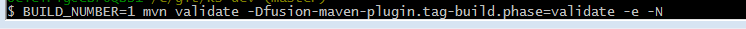

# Impex Process

In the CM 2.x release the wiki steps for the legacy impex process can be followed.

In the master branch of the ks-development and ks-development-impex repositories the following process should be used.

1. tag ks-development build X
2. build -sql jars from ks-development
3. tag ks-development-impex build X
4. run the manual impex process which generates .mpx files
5. git add the .mpx files and commit them into the repository 
5.1 create a build tag on the files
6. load the impex data from the ks-development:ks-deployments/ks-dbs/ks-impex artifact (it will resolve using maven the artifacts created in step 5). 

Ideally the results of the manual impex process would be published into the kuali nexus repository however it can also work if the .mpx files are added into the Git repository and pushed into github.

The github 100 MB file max size will still apply so remember to keep an eye on the total amount of data that is added.  Github's limit is based on the size of the file when materialized in the file system not its actual delta compressed size which is typically much smaller.
## Example: Tag ks-development build 1

In the ks-development root directory, tag build 1:

``` BUILD_NUMBER=1 mvn validate -Dfusion-maven-plugin.tag-build.phase=validate -e -N ```



## Example: Tag ks-development-impex build 1

In the ks-development-impex root directory, tag build 1:


